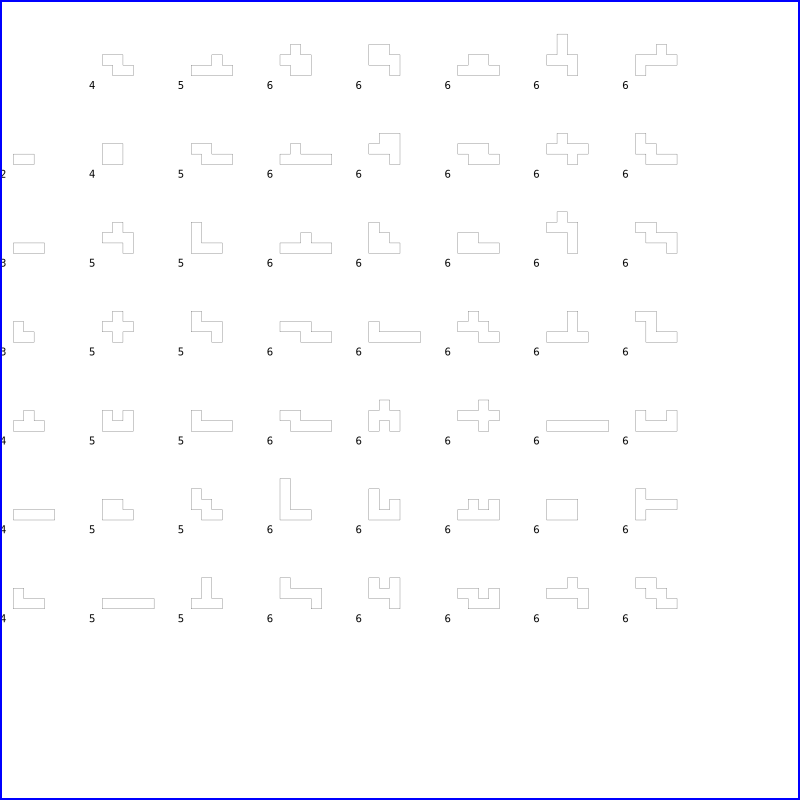

# Blockus

## Just generates blocks

```python
SQUARE = [Point(0.0,0.0), Point(1.0,0.0), Point(1.0,1.0), Point(0.0,1.0)]    
runn(SQUARE, 6, "svg/square6.svg")
```

will generate the set of unique shapes that can be created from 6 squares:



```python
TRIANGLE = [Point(0.0, 0.0), Point(0.5,(1/2)*math.sqrt(3)),Point(1.0,0.0)]
runn(TRIANGLE, 7, "svg/triangle7.svg")
```

will generate the set of unique shapes that can be created from 7 triangles:


