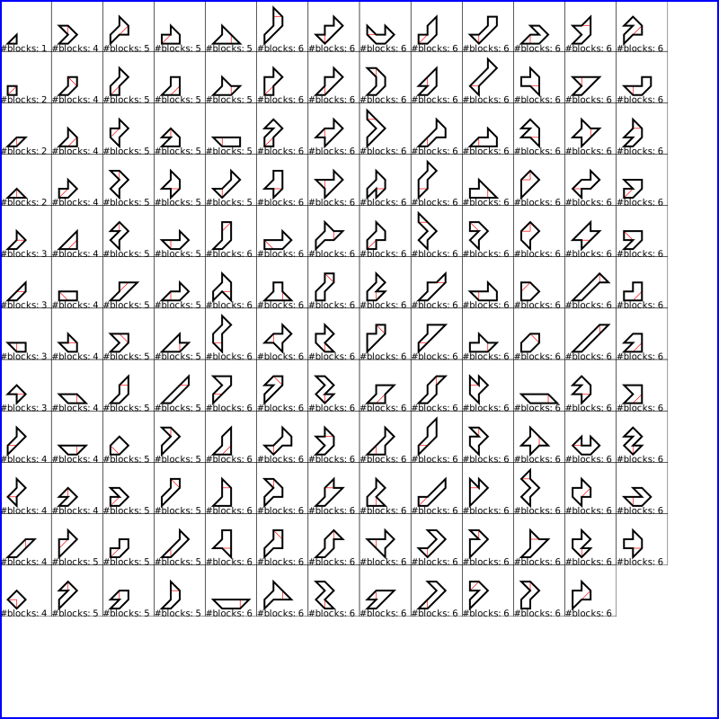

# Blockus

## Just generates blocks

```python
SQUARE = [Point(0.0,0.0), Point(1.0,0.0), Point(1.0,1.0), Point(0.0,1.0)]    
runn(SQUARE, 5, "svg/square5.svg")
```

will generate the 21 unique shapes used in the classic Blokus/Duo game.  These are all the possible shapes formed from 1 to 5 squares.


```python
TRIANGLE = [Point(0.0, 0.0), Point(0.5,(1/2)*math.sqrt(3)),Point(1.0,0.0)]
runn(TRIANGLE, 7, "svg/triangle7.svg")
```

will generate the 22 unique shapes used in the classic Blokus Trigon game.  These are all the possible shapes formed from 1 to 6 equilateral triangles.


So how about a different type of triangle?
This here: 

```python
ISOTRIANGLE = [Point(0.0, 0.0), Point(1.0, 1.0), Point(1.0,0.0)]
runn(ISOTRIANGLE, 6, "svg/iso_triangle6.svg")
```

will generate the 155 possible unique shapes that can be created from using 1 to 6 isosceles triangles:



What about Pentagons?  
```python
PENTAGON = [Point(x,y) for (x,y) in pentagon(1.0)]
runn(PENTAGON, 5, "svg/pentagon5.svg")
runn(PENTAGON, 6, "svg/pentagon6.svg")
```
will generate the set of 36 unique shapes that can be created using 1 to 5 pentagons:


and the set of 154 unique shapes that can be created using 1 to 6 pentagons:


Note that we get just one more shape when using up to 6 isosceles triangles than when using up to 6 pentagons.

7 equilateral triangles only gives us only 46 unique shapes:


Cool, huh?
